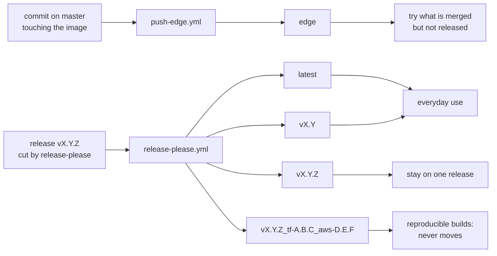

# Publishing

How the images reach the registry. This page is the single home for the
**publication matrix** (which workflow owns which tag), the **credential
model** and the **publication reliability model**. The same tags are described
for users, by what they point at rather than by who writes them, in the
[README](../README.md#-supported-tags-and-respective-dockerfile-links); the
decision behind the matrix is [ADR-0018](adr/0018-single-owner-publication-matrix.md).

## Publication matrix

Two git events publish images, and **each tag has exactly one publisher** — a
mutable tag with two writers has no defined content (ADR-0018).

| Tag | Publisher | Trigger | Mutable | Points at |
|---|---|---|---|---|
| `edge` | `push-edge.yml` | push to `master` touching the image | yes | latest supported combination, built from `master` |
| `latest` | `release-please.yml` | release created | yes | the newest release, latest supported combination |
| `vX.Y` | `release-please.yml` | release created | yes | latest patch of that minor line |
| `vX.Y.Z` | `release-please.yml` | release created | no | that release, latest supported combination |
| `vX.Y.Z_tf-A.B.C_aws-D.E.F` | `release-please.yml` | release created | **no** | one fixed combination, never re-pushed |

Every tag in this table except `edge` is asserted by `verify_release` after
each release: the pinned tags must exist, and the floating ones must resolve to
the same digest as the release's pinned tag. `edge` is not part of a release and
is reproduced by the next `master` push. Rollback semantics for the immutable
form: [`docs/rollback.md`](rollback.md).

## Registry credentials (least privilege)

Credentials are GitHub repository secrets (values live in **Settings → Secrets**).
Scopes stay minimal so the token that pushes images never carries `Delete`:

| Secret | Docker Hub scope | For |
|--------|------------------|-----|
| `DOCKERHUB_USERNAME` | — | account name |
| `DOCKERHUB_PAT` | Read & Write | pushing image tags |
| `DOCKERHUB_DESCRIPTION_PAT` | Read, Write & Delete | the description API, which rejects tokens without `Delete` |

The `Delete`-scoped token is used only by the push-to-`master` description
workflow, never in a `pull_request`-triggered one ([ADR-0013](adr/0013-pr-triggered-ci-security-boundary.md)).

## Publication reliability

Publication is complete only when **every** expected tag exists on the
registry. Three guards enforce this, all defined in the workflows:

1. Tool downloads in the `Dockerfile` retry transient failures, including
   connection resets.
2. The publish and test matrices do not fail fast: matrix jobs produce
   independent immutable tags, so a failed combo never cancels its siblings.
3. The `verify_release` job asserts each expected tag **and the digest it
   resolves to** after the builds, checks that the registry's immutability
   rules match the **Mutable** column above, and **opens an issue** when the
   publication is incomplete, even on partial matrix failure.

Rationale: two releases once shipped with zero images because a single
transient download failure cancelled the whole publish matrix, and the red
runs went unnoticed (incident record: #106, fix: #149). A later release left
`latest` and `vX.Y` serving the previous image while the gate stayed green,
because asserting that a tag exists says nothing about what it points at
(incident record: #171).
